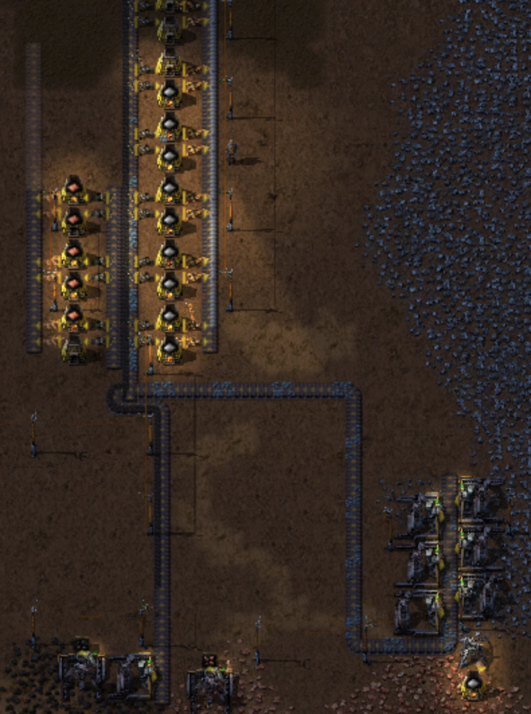
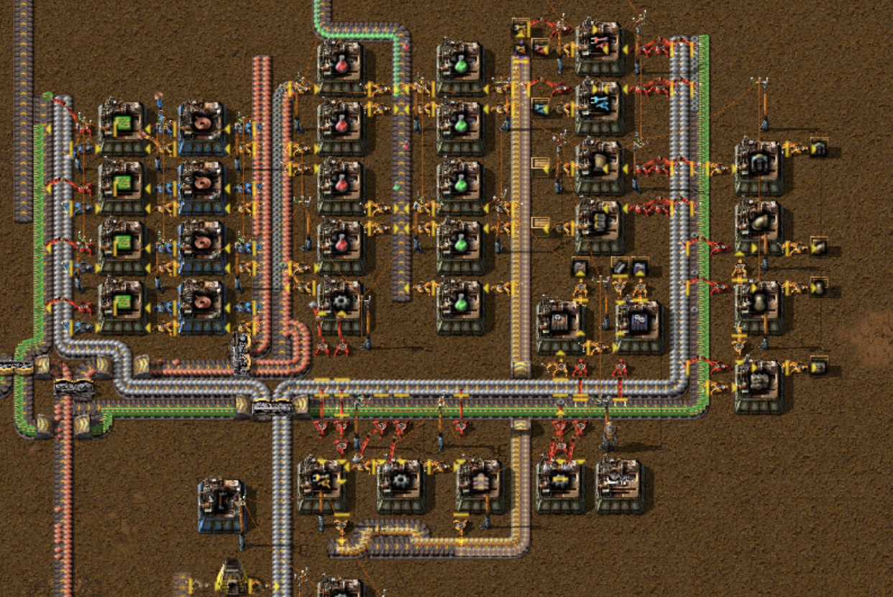
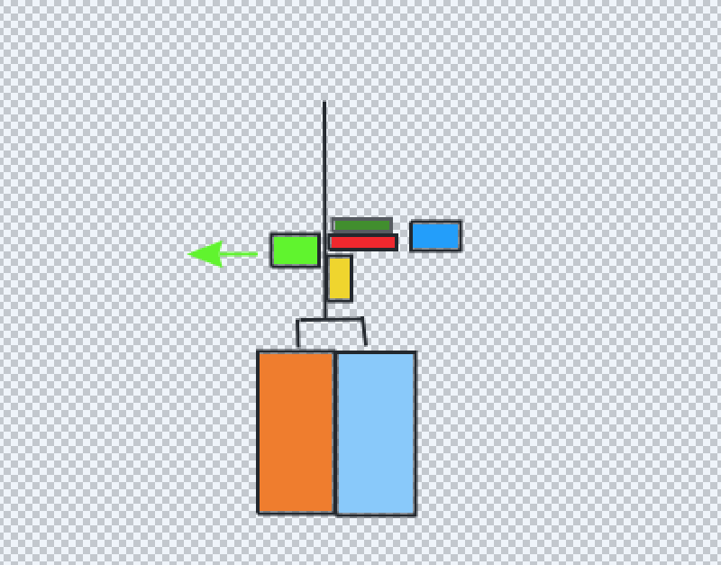

# There is no spoon

## Map
```
	>>>eNpjZICDBvvVq1bZcbAk5yfmgHgMDAccgMIOXMn5BQWpRbr5RalA
	IbgwZ3JRaUqqbn4mVLEDRHFqXmpupW5SYnEqRBiCOTKL8vPQTWAtLsn
	PS0W2irWkKDW1GOYUEM1dWpSYl1maC9ELUskAVsnAmBBz/m1DixwDCP
	+vZ1D4/x+EgawHQHkQZmBsAJvCCBSDAdbknMy0NAYGBUcgdgIrYmCsF
	lnn/rBqij0jRI2eA5QhAGUcSIKJeMIYfrilVGAMEyRzjMHgsz2CAbG0
	BGgpVBWHA4IBkWwBSzL2vt264PuxC3aMf1Z+vOSblGDPaOgq8u6D0To
	7oCQ7yAtMcGLWTBDYCfMKA8zMB/ZQqZv2jGfPgMAbe0ZWkA4REOFgAS
	QOeDMzMArwAVkLeoCEggwDzGl2MGNEHBjTwOAbzCePYYzL9uj+AAaED
	chwORBxAkSALYS7jBHCdOh3YHSQh8lKIpQA9RsxILshBeHDkzBrDyPZ
	j+YQzIhA9geaiIoDlmjgAlmYAideMMNdAwzPC+wwnsN8B0ZmEAOk6gt
	QDMKDJlWwUbCEwIzIbgwf7BnmnyjoAACBw6HB<<<
```
## Doc
https://docs.google.com/document/d/1FE2kEYuqQK-l9VyRHTW4oz5NyOE8i7qtRQKeOurkPUw/edit

## Phase 1 - Starting out
Phase 1 zou ongeveer 15 minuten moeten duren

### Bram
- Zet miner bovenaan coal patch
- Verken de map en kill de biters
    - mijn ook stone rocks (geen patches) als je deze tegen komt, maak stone furnaces zodra het kan (tijdens lopen)
    - chop ook 100-200 bomen

### Robbie
- Mine de stenen naast het schip / loot het schip
- Zet een miner tegenover de miner van de Defender
- Supply de `Mineral miner`/mine coal manually
- Supply de builder met coal
- Bij een overdosis aan coal, help eventueel de mineral miner

### Sidney
- Loot het schip
- Mine de stenen naast het schip
- Zet je miner met oven neer onderaan de iron patch (net boven de copper patch)
- Maak ondertussen ook 10 red science voor de `builder` / mine manually steen voor 20 ovens en vervolgens meer ijzer en koper (1/3 koper 2/3 ijzer)
- Maak 20 ovens en gebruik de eerste ~2 om je manual geminde ores in op te smelten
- Maak een electric miner voor de iron patch (tegenover de oude miningdrill)
- Maak een electric miner voor de copper. Verplaats de oude miningdrill naar de coal patch

### Luuk
- Hak 1/2 van de bomen onder het schip
- Zet je miner met oven op de copper patch (net onder de iron patch)
- Maak een 'general' kist, een kist voor de mineral miner en een kist voor de coal miner
- Drop je hout in de kist naast de mineral miner
- Maak een pump, furnace, steam generator, powerpole, en een lab
- Doe de 'automation' research
- Maak een burner inserter met kist om de steam generators te supply'en
- Maak een blueprint voor 20 boilers (tot halverwege de copper patch)
- Connect de stroom met coal/iron/copper


## Phase 2 - Initial smelting array

<table>
    <tr>
        <td>initial smelting</td>
        <td>science + make-everything</td>
    </tr>
    <tr>
        <td></td>
        <td></td>
    </tr>
    <tr>
        <td colspan="2"></td>
    </tr>
<table>

### Bram
- ga weer terug richting base
- Maak powerpoles van je wood en stop deze samen met de ovens in de centrale itemskist
- Drop de coal in de coalboxjes
- Maak tussen de 10 en 20 labs en help anderen mee
- Zodra de smelting area staat, bouw (eventueel met luuk) de red science setup (zie rode area in paint plaatje)
- Bouw vervolgens samen met luuk derest van die science setup
- Bouw eventueel een trein voor get on track like a pro

### Robbie
- maak 2 assemblers, en laat die gears en copper wire maken (vul ze ook aan)
- onderhoud coal en steam turbines
- zodra de smelting array wordt aangesloten, zorg dat er 3 of 4 steam engines aangesloten staan (adhv verbruik)
- Blijf ondertussen ook nog focussen op het input verbruik van de coal
- Als input verbruik stabiel is (zowel bij jou als sidney), bouw samen met sidney de shopping mall in de gele area op het paint plaatje
	- ZORG DAT ZE NIET VOLLEDIGE KISTJES VULLEN (reken voor iedereen die het gebruikt 1 stack)
	- Assembler producing pipes (both types)
	- Assembler producing electric mining drills
	- Assembler producing boiler + steam engine
	- Assembler producing assembler1 and assembler2
	- Assembler producing belts, splitter and underground belt
	- Assembler producing blue, yellow, and red arms
- Bouw eventueel een trein voor get on track like a pro


### Sidney
- maak 8 electric mining drills, zet zodra het kan er 1 weg op coal en 1 op copper, de rest op iron
- maak 18 yellow inserters en stop ze de box
- vul de gear en copper wire assemblers aan
- zodra de smelting array wordt aangesloten zorg dat er genoeg resources zijn, maak extra mining drills indien nodig
- maak 16 yellow inserters en stop ze in de box
    - gebruik copper wire uit de assembler
- Blijf ondertussen ook nog focussen op het input verbruik
- Als input verbruik stabiel is (zowel bij jou als sidney), bouw samen met sidney de shopping mall in de gele area op het paint plaatje
	- ZORG DAT ZE NIET VOLLEDIGE KISTJES VULLEN (reken voor iedereen die het gebruikt 1 stack)
	- Assembler producing pipes (both types)
	- Assembler producing electric mining drills
	- Assembler producing boiler + steam engine
	- Assembler producing assembler1 and assembler2
	- Assembler producing belts, splitter and underground belt
	- Assembler producing blue, yellow, and red arms
- Bouw eventueel een trein voor get on track like a pro

### Luuk
- Verzorg de storage boxen setup
- Bouw vanaf links boven de coal / halverwege de iron patch de smelting setup
    - 12 ovens voor iron (rechts), 6 voor copper (links van iron) met 4 tiles er tussen (2 furnaces breed)
    - gebruik furnaces en inserters die in de box gestopt zijn om de setup te bouwen
	- 1 oven voor steel
	- Save blueprint
- Bouw de main belt (koper links iron middel steel rechts met 2 tussen ieder)
- Bouw samen met bram de science setup
- Bouw eventueel een trein voor get on track like a pro

## Phase 3 - Blue science
Time|Branm|Ronbie|Sindney|Luunk|
|-	|-	|-	|-	|-	|
|0:00|  |  	|  	|  	|

## Phase 4 - Purple science
Time|Branm|Ronbie|Sindney|Luunk|
|-	|-	|-	|-	|-	|
|0:00|	|  	|  	|  	|

## phase 5 - Full production
Time|Branm|Ronbie|Sindney|Luunk|
|-	|-	|-	|-	|-	|
|0:00|	|  	|  	|  	|

## phase 6 - Yellow Sience
Time|Branm|Ronbie|Sindney|Luunk|
|-	|-	|-	|-	|-	|
|0:00|	|  	|  	|  	|

## phase 7 - Spoon time
Time|Branm|Ronbie|Sindney|Luunk|
|-	|-	|-	|-	|-	|
|0:00|	|  	|  	|  	|
